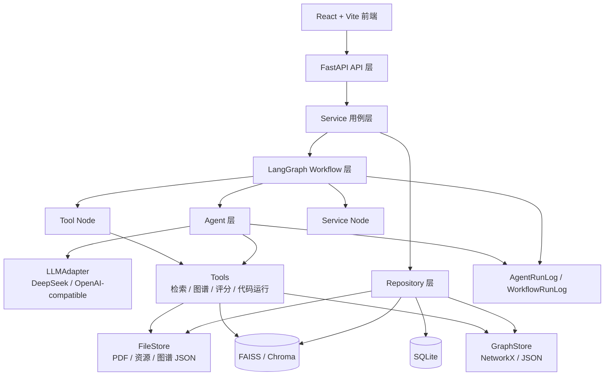

# 00. 系统总体架构

## 目标

构建一个低耦合、高工程规范、可扩展的多智能体个性化学习助手。系统以自然语言对话为核心入口，自动构建学生画像，结合 PDF 学习资料、会话历史、练习结果和学习行为，生成个性化资源、学习路径、知识图谱，并支持智能辅导和学习效果评估。

## 分层职责

| 层 | 职责 | 禁止事项 |
|---|---|---|
| Frontend | 页面展示、用户交互、调用 API | 不写复杂业务工作流 |
| API | 参数校验、鉴权、调用 Service | 不直接调用 Agent/LLM |
| Service | 业务用例编排、事务、读写 Repository、启动 Workflow | 不写 Prompt |
| Workflow | 用 LangGraph 编排 Agent Node / Tool Node / Service Node | 不直接写数据库 |
| Agent | 单一智能任务：判断、生成、分析 | 不直接写数据库，不跨职责 |
| Tool | PDF、检索、切片、图谱、评分等确定性能力 | 不保存业务结果 |
| Repository | SQLite 数据读写 | 不调用 Agent/LLM |
| Storage | 文件、向量库、图谱 JSON 的适配 | 不承载业务规则 |
| LLM | 封装 DeepSeek / OpenAI-compatible API | 不暴露给 API 层 |

## 依赖方向

```text
frontend -> api
api -> service
service -> workflow
workflow -> agent
workflow -> tool node
service -> repository
repository -> storage
agent -> llm adapter
agent -> tool
```

明确禁止：

```text
api -> llm
api -> agent
agent -> repository
agent -> database
frontend page -> business workflow
tool -> service
```

## 总体架构图



## 核心运行模式

用户操作不会直接触发某个 Agent，而是走统一链路：

```text
前端操作
-> API Request
-> Service
-> Workflow
-> Agent Node / Tool Node / Service Node
-> LLM / Tool / Storage
-> Workflow State
-> Service 保存结果
-> API Response
-> 前端展示
```

## 精简 Agent 策略

系统保留 7 个核心 Agent：

```text
Intent Agent
Profile Agent
Tutor Agent
Resource Agent
Planner Agent
KG Agent
Evaluator Agent
```

资源类型很多，但不拆成很多 Agent；统一由 `Resource Agent` 根据 `resource_type` 生成：

```text
course_doc
mindmap
exercise
reading
video_script
code_practice
```
