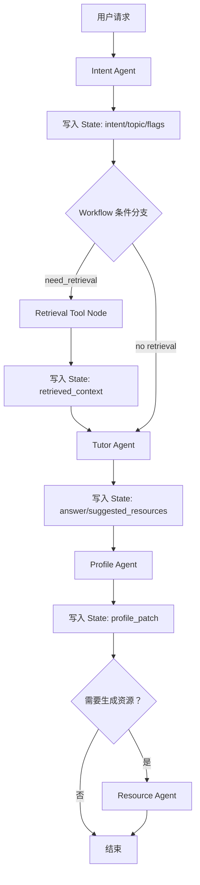

# 01. 精简后的智能体设计

## 什么才算 Agent

Agent 不是普通函数，也不是单独一个 Prompt。

```text
Agent = 角色目标 + 输入结构 + 推理/决策逻辑 + 工具能力 + 输出结构 + 运行记录
```

判断一个模块是否是 Agent：

- 是否有明确角色和边界。
- 是否需要 LLM 做判断、分析或生成。
- 是否有独立输入输出 Schema。
- 是否能被 Workflow 编排。
- 是否能单独 mock 和测试。
- 是否有 AgentRunLog。

不应做成 Agent 的模块：

- PDF 解析
- 文件保存
- 数据库查询
- 文本切片
- 向量入库
- 图谱 JSON 保存

这些属于 Service / Tool / Repository。

## 7 个核心 Agent

| Agent | 核心职责 | 不负责 | LLM | Tool | 读写存储 | 可测试职责 |
|---|---|---|---|---|---|---|
| Intent Agent | 识别意图、主题、是否需要检索/画像/资源/评估 | 不回答问题、不生成资源 | 是 | 否 | 否 | 同一输入输出稳定意图 |
| Profile Agent | 抽取画像变化、生成 ProfilePatch | 不保存画像、不生成讲解 | 是 | 否 | 否 | 输出维度、置信度、evidence |
| Tutor Agent | 个性化讲解、答疑、多模态解释规划 | 不更新数据库、不生成完整资源库 | 是 | 可调用局部工具 | 否 | 回答是否贴合资料和画像 |
| Resource Agent | 生成文档、思维导图、练习、阅读、视频脚本、代码案例 | 不规划路径、不推荐资源 | 是 | Mindmap/CodeRunner 可选 | 否 | 按 resource_type 输出结构化资源 |
| Planner Agent | 生成和调整学习路径 | 不生成具体资源内容 | 是 | 可读取资源索引工具 | 否 | 路径阶段、顺序、评估点合理 |
| KG Agent | 抽取实体关系、输出图谱数据 | 不解析 PDF、不保存图谱文件 | 是 | Graph Tool | 否 | nodes/edges 格式正确 |
| Evaluator Agent | 批改/评估掌握度、薄弱点、调整建议 | 不直接修改画像/路径 | 是 | Grading Tool | 否 | 输出分数、弱点、建议 |

## Agent 输入输出 Schema 示例

### Intent Agent

Input：

```json
{
  "student_id": "stu_001",
  "task_id": "task_ai_ch3",
  "message": "我不理解归结推理，能结合例子讲吗？",
  "conversation_summary": "学生正在学习确定性推理"
}
```

Output：

```json
{
  "intent": "tutoring_question",
  "topic": "归结推理",
  "confidence": 0.93,
  "need_retrieval": true,
  "need_profile_update": true,
  "need_resource_suggestion": true,
  "target_workflow": "ChatProfileWorkflow"
}
```

### Profile Agent

Input：

```json
{
  "student_id": "stu_001",
  "old_profile_summary": {
    "knowledge_level": "初中级",
    "weak_points": ["谓词逻辑"]
  },
  "signals": [
    {
      "source_type": "message",
      "source_id": "msg_001",
      "content": "我不理解归结推理"
    }
  ]
}
```

Output：

```json
{
  "patches": [
    {
      "dimension": "weak_points",
      "value": "归结推理",
      "operation": "append",
      "confidence": 0.9,
      "evidence": [
        {
          "source_type": "message",
          "source_id": "msg_001",
          "quote": "我不理解归结推理"
        }
      ]
    }
  ]
}
```

### Tutor Agent

Input：

```json
{
  "question": "归结推理是什么？",
  "topic": "归结推理",
  "profile_summary": {
    "knowledge_level": "初中级",
    "learning_preference": ["例子", "步骤化解释"]
  },
  "retrieved_context": [
    {
      "source": "pdf",
      "page": 73,
      "content": "归结原理是在子句集基础上讨论问题..."
    }
  ]
}
```

Output：

```json
{
  "answer": "归结推理可以理解为通过消去互补文字来证明结论...",
  "explanation_style": "example_first",
  "used_sources": ["pdf:mat_001:73"],
  "follow_up_questions": ["要不要我用一道题带你走一遍？"],
  "suggested_resource_types": ["mindmap", "exercise"]
}
```

### Resource Agent

Input：

```json
{
  "task_id": "task_ai_ch3",
  "topic": "归结推理",
  "resource_type": "mindmap",
  "profile_summary": {
    "weak_points": ["归结推理"],
    "resource_preference": ["图解"]
  },
  "context": ["归结推理相关资料片段..."]
}
```

Output：

```json
{
  "resource_type": "mindmap",
  "title": "归结推理思维导图",
  "content": {
    "root": "归结推理",
    "children": [
      {
        "label": "子句集",
        "children": ["文字", "互补文字", "空子句"]
      }
    ]
  },
  "profile_match_reason": "学生偏好图解，且归结推理是当前薄弱点"
}
```

### Planner Agent

Output 示例：

```json
{
  "path_title": "确定性推理学习路径",
  "steps": [
    {
      "order": 1,
      "objective": "理解推理分类和基本概念",
      "resource_types": ["course_doc", "mindmap"],
      "exercise_focus": "概念判断"
    },
    {
      "order": 2,
      "objective": "掌握归结推理过程",
      "resource_types": ["exercise", "video_script"],
      "exercise_focus": "推理步骤"
    }
  ]
}
```

### KG Agent

Output 示例：

```json
{
  "nodes": [
    {
      "id": "归结推理",
      "label": "归结推理",
      "type": "METHOD",
      "weight": 0.9
    }
  ],
  "edges": [
    {
      "source": "归结推理",
      "target": "确定性推理",
      "relation": "part_of",
      "confidence": 0.88
    }
  ],
  "summary": "该图谱围绕确定性推理、子句集、归结原理和推理策略展开。"
}
```

### Evaluator Agent

Output 示例：

```json
{
  "mastery_score": 0.72,
  "weak_points": ["MGU 算法", "子句化"],
  "mistake_patterns": ["步骤遗漏", "概念混淆"],
  "path_adjustment_suggestion": "增加归结推理例题训练",
  "profile_patches": [
    {
      "dimension": "weak_points",
      "value": "MGU 算法",
      "confidence": 0.84,
      "evidence": [
        {
          "source_type": "exercise_attempt",
          "source_id": "att_001"
        }
      ]
    }
  ]
}
```

## 智能体协作机制

智能体之间不直接互相聊天，而是通过 `Workflow State` 传递结构化数据。

```text
Agent A 读取 State 的部分字段
Agent A 输出结构化 JSON
Workflow 校验后写入 State
Workflow 根据条件选择下一个节点
Agent B 读取 State 中需要的字段
```



## 防止超级 Agent

规则：

- Intent Agent 不生成答案。
- Tutor Agent 不维护画像。
- Profile Agent 不保存画像，只输出 patch。
- Resource Agent 不规划路径。
- Planner Agent 不生成资源正文。
- Evaluator Agent 不直接修改路径，只输出建议。
- KG Agent 不解析 PDF，只处理已准备好的文本。

