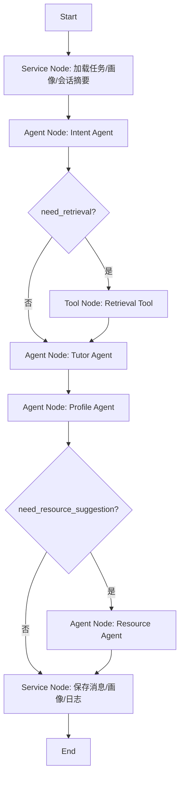
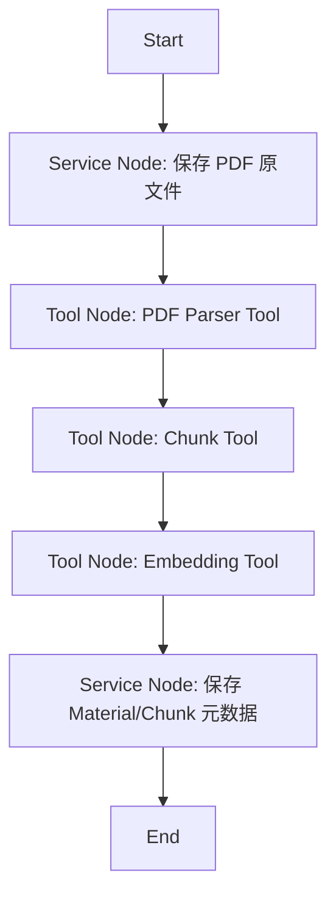
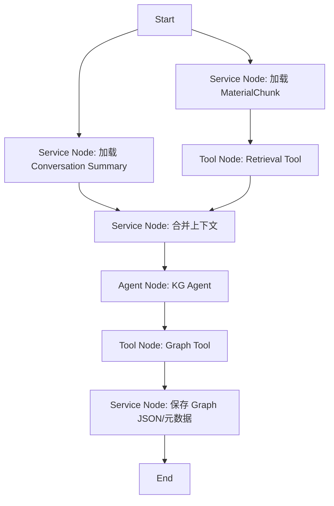
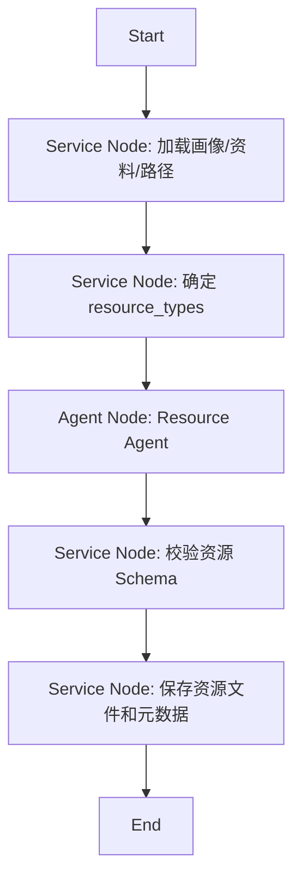
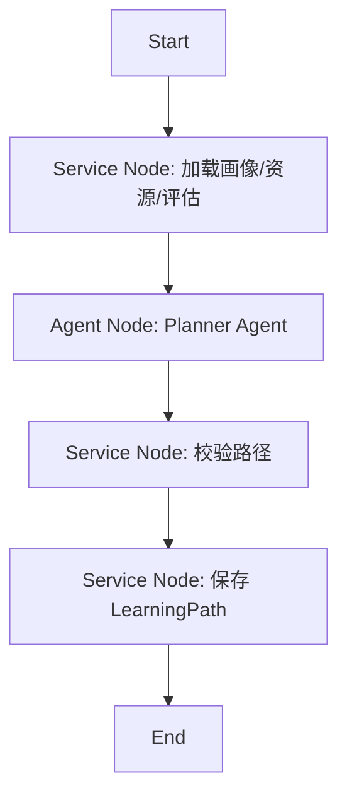
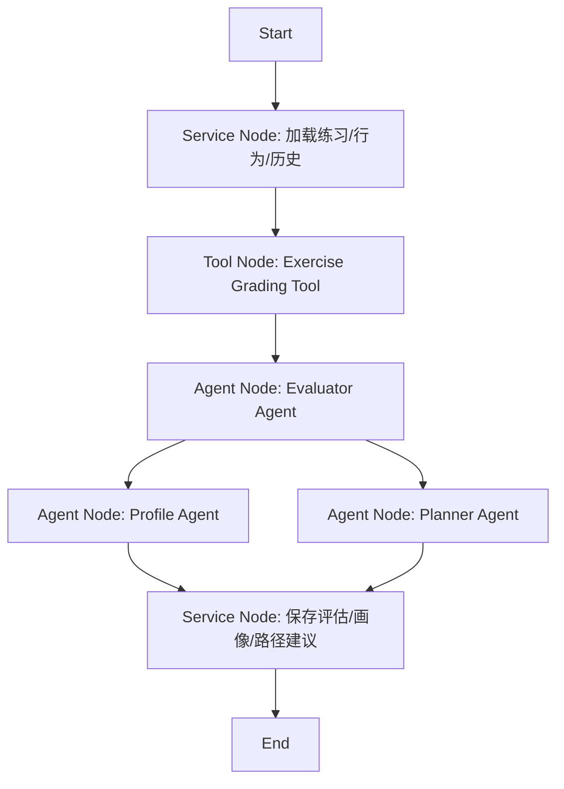

# 02. LangGraph Workflow 设计

Workflow 负责把 Agent、Tool Node、Service Node 编排成稳定流程。Agent 不直接互相调用，而是通过 `Workflow State` 传递结构化数据。

## 节点类型

| 节点类型 | 用途 | 示例 |
|---|---|---|
| Agent Node | 调用某个 Agent 做判断/生成/分析 | Intent Agent、Tutor Agent |
| Tool Node | 调用确定性工具 | Retrieval Tool、PDF Parser Tool |
| Service Node | 读写数据库、保存文件、组装响应 | SaveProfilePatch、SaveGraph |

## 1. ChatProfileWorkflow

用途：对话、意图识别、画像更新、答疑。

Input：

```json
{
  "student_id": "stu_001",
  "task_id": "task_ai_ch3",
  "conversation_id": "conv_001",
  "message": "我不理解归结推理"
}
```

State：

```json
{
  "student_id": "",
  "task_id": "",
  "message": "",
  "intent": null,
  "profile_summary": null,
  "retrieved_context": [],
  "answer": null,
  "profile_patch": null,
  "resources": [],
  "errors": []
}
```

流程：



失败回退：

- Intent 失败：默认进入 Tutor。
- Retrieval 失败：Tutor 使用画像和历史回答。
- Profile 失败：不阻断答疑，只记录错误。
- Resource 失败：返回 answer，不返回资源。

Output：

```json
{
  "answer": "归结推理可以理解为...",
  "profile_updated": true,
  "resources": [],
  "sources": []
}
```

## 2. MaterialIngestionWorkflow

用途：PDF 上传、解析、切片、向量入库。



Input：

```json
{
  "student_id": "stu_001",
  "task_id": "task_ai_ch3",
  "file_path": "data/materials/task_ai_ch3/raw/chapter3.pdf"
}
```

Output：

```json
{
  "material_id": "mat_001",
  "status": "indexed",
  "chunk_count": 42
}
```

## 3. KnowledgeGraphWorkflow

用途：基于 PDF + 会话生成知识图谱。



Output：

```json
{
  "graph_id": "kg_001",
  "node_count": 120,
  "edge_count": 96,
  "graph_path": "data/graphs/task_ai_ch3/graph.json"
}
```

## 4. ResourceGenerationWorkflow

用途：生成多类型个性化学习资源。



说明：Resource Agent 不拆成多个 Agent，而是根据 `resource_type` 走内部 Prompt 模板。

支持类型：

```text
course_doc
mindmap
exercise
reading
video_script
code_practice
```

## 5. LearningPathWorkflow

用途：生成和调整学习路径。



## 6. AssessmentWorkflow

用途：练习评估、学习效果评估、路径调整建议。



Output：

```json
{
  "assessment_id": "assess_001",
  "mastery_score": 0.72,
  "weak_points": ["MGU 算法"],
  "path_adjusted": true
}
```

