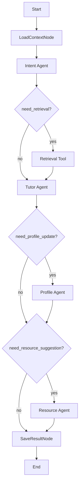
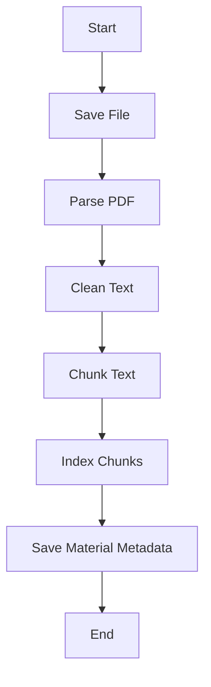
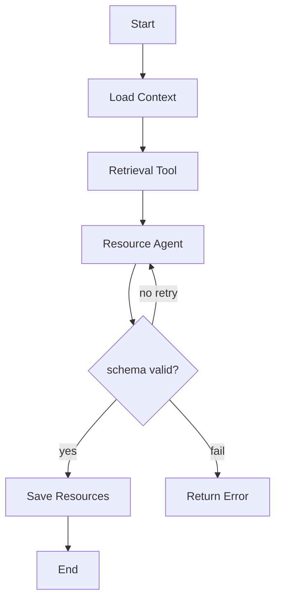
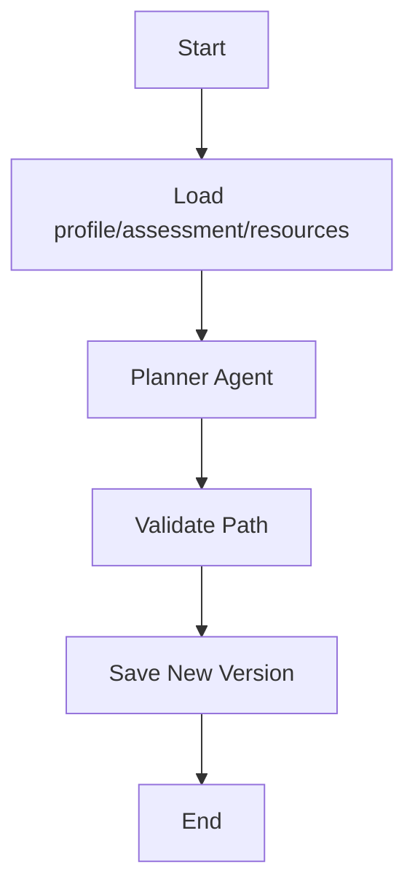
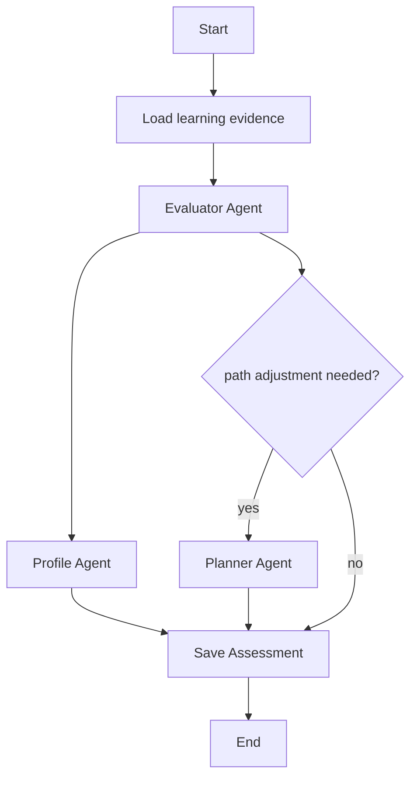
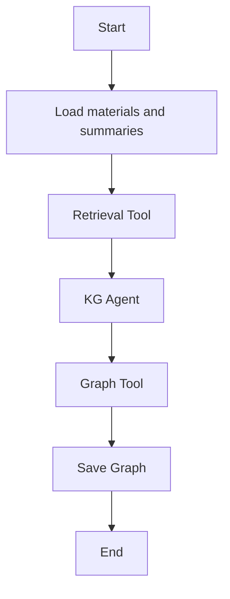
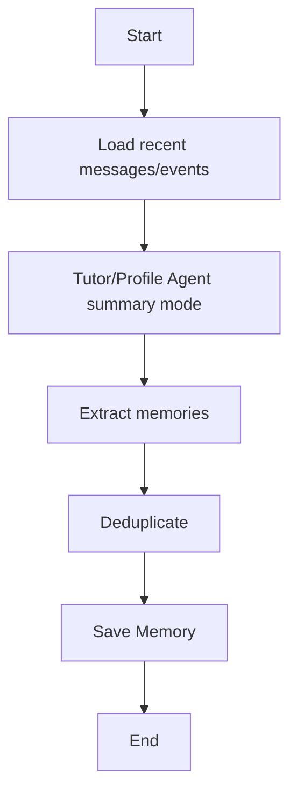

# 最终后端完整实现计划

## 一、后端总体目标

本后端用于支撑“高等教育个性化学习资源体系”和“多智能体个性化学习助手”。

第一版不是简单 mock 后端，而是直接建设可运行、可联调、可测试、可追踪的真实多智能体后端：

```text
FastAPI + SQLite + 本地文件存储 + LangGraph + RAG + DeepSeek deepseek-v4-flash
```

第一版必须真实可用：

- 任务管理。
- 学习画像查看与随学更新。
- 学习资料上传、解析、切片、检索。
- 对话答疑，结合任务、画像、资料、历史上下文和评估结果。
- 个性化资源生成。
- 学习路径查看和动态调整。
- 学习效果评估。
- AgentRunLog 查询。
- RAG 来源追踪和基础防幻觉。

允许第一版简化但不能缺架构：

- 向量检索可先用本地 embedding 或轻量 TF-IDF fallback，但接口和存储要按可替换向量库设计。
- 图谱前端页面可后续接入，但后端 `KnowledgeGraphWorkflow` 和基础接口要预留。
- 资源内容可先保存 JSON，不必第一版生成复杂文件导出。
- 视频资源第一版生成脚本/分镜，不直接生成视频。

DeepSeek 配置位置：

```text
backend/.env
```

`.env.example` 必须提供：

```env
APP_NAME=multi-agent-learning-backend
ENV=dev

DATABASE_URL=sqlite:///./data/app.db
DATA_DIR=./data

LLM_PROVIDER=deepseek
DEEPSEEK_API_KEY=
DEEPSEEK_BASE_URL=https://api.deepseek.com
DEEPSEEK_MODEL=deepseek-v4-flash
LLM_TEMPERATURE=0.2
LLM_TIMEOUT_SECONDS=60
LLM_MAX_RETRIES=2

CORS_ORIGINS=http://127.0.0.1:5173,http://localhost:5173
```

启动方式：

```bash
cd backend
pip install -r requirements.txt
copy .env.example .env
# 编辑 .env，填写 DEEPSEEK_API_KEY
uvicorn app.main:app --reload --host 127.0.0.1 --port 8000
```

健康检查：

```text
http://127.0.0.1:8000/api/health
```

DeepSeek 官方信息：

- OpenAI-compatible base_url：`https://api.deepseek.com`
- 第一版默认模型：`deepseek-v4-flash`
- `deepseek-chat` 和 `deepseek-reasoner` 将废弃，不作为新项目默认模型。

## 二、后端目录结构

```text
backend/
  app/
    main.py
    api/
      router.py
      health.py
      tasks.py
      profile.py
      materials.py
      chat.py
      resources.py
      learning_path.py
      assessment.py
      knowledge_graph.py
      agent_runs.py
    schemas/
      common.py
      task.py
      profile.py
      material.py
      chat.py
      resource.py
      learning_path.py
      assessment.py
      knowledge_graph.py
      agent_run.py
      memory.py
    domain/
      enums.py
      models.py
      value_objects.py
    services/
      task_service.py
      profile_service.py
      material_service.py
      chat_service.py
      resource_service.py
      learning_path_service.py
      assessment_service.py
      knowledge_graph_service.py
      memory_service.py
      agent_log_service.py
    workflows/
      state.py
      chat_profile_workflow.py
      material_ingestion_workflow.py
      resource_generation_workflow.py
      learning_path_workflow.py
      assessment_workflow.py
      knowledge_graph_workflow.py
      memory_maintenance_workflow.py
    agents/
      base.py
      intent_agent.py
      profile_agent.py
      tutor_agent.py
      resource_agent.py
      planner_agent.py
      evaluator_agent.py
      kg_agent.py
      prompts/
        intent_agent_v1.md
        profile_agent_v1.md
        tutor_agent_v1.md
        resource_agent_v1.md
        planner_agent_v1.md
        evaluator_agent_v1.md
        kg_agent_v1.md
    repositories/
      base.py
      student_repo.py
      task_repo.py
      profile_repo.py
      material_repo.py
      conversation_repo.py
      resource_repo.py
      learning_path_repo.py
      assessment_repo.py
      memory_repo.py
      knowledge_graph_repo.py
      agent_run_repo.py
    storage/
      database.py
      file_store.py
      vector_store.py
      graph_store.py
    ingestion/
      pdf_parser.py
      text_cleaner.py
      chunker.py
      indexer.py
    llm/
      adapter.py
      deepseek_adapter.py
      fake_adapter.py
      json_parser.py
      token_counter.py
    tools/
      retrieval_tool.py
      grading_tool.py
      graph_tool.py
      code_runner_tool.py
      rerank_tool.py
    core/
      config.py
      errors.py
      logging.py
      ids.py
      time.py
  data/
    materials/
    resources/
    graphs/
    vector/
    app.db
  tests/
    unit/
    integration/
    api/
  .env.example
  requirements.txt
  README.md
```

目录职责：

| 目录 | 职责 |
|---|---|
| `api/` | FastAPI 路由，参数校验、鉴权、调用 Service |
| `schemas/` | Pydantic 请求/响应 DTO |
| `domain/` | 领域模型、枚举、值对象 |
| `services/` | 业务用例编排、事务、Repository 调用、Workflow 调用 |
| `workflows/` | LangGraph 状态机，编排 Agent / Tool / Service Node |
| `agents/` | 单职责智能体，调用 LLM，输出结构化 JSON |
| `agents/prompts/` | Agent Prompt 模板，必须版本化 |
| `repositories/` | 数据库 CRUD 和查询封装 |
| `storage/` | SQLite、本地文件、向量库、图谱文件适配 |
| `ingestion/` | PDF/文本解析、清洗、切片、索引 |
| `llm/` | DeepSeek/Fake LLM 统一适配、JSON 解析、token 统计 |
| `tools/` | 检索、评分、图谱、代码运行、rerank 等确定性能力 |
| `core/` | 配置、错误、日志、ID、时间工具 |
| `tests/` | 单测、集成测试、API 测试 |
| `data/` | 本地文件、SQLite、向量索引、图谱 JSON |

## 三、核心模块职责边界

| 模块 | 职责 | 禁止事项 |
|---|---|---|
| API | 接收请求、校验参数、调用 Service、返回 DTO | 不直接调用 LLM/Agent/Repository |
| Service | 业务用例、事务、读写 Repository、启动 Workflow | 不写 Prompt、不拼 Agent 内部逻辑 |
| Workflow | 编排 Agent/Tool/Service Node，维护 State | 不直接写业务表 |
| Agent | 单一智能任务，调用 LLM，输出 JSON | 不写数据库、不保存文件、不跨职责 |
| Tool | 确定性处理，如检索、评分、图谱转换、代码运行 | 不保存业务最终结果 |
| Repository | 数据库 CRUD 和查询 | 不调用 Service/Agent/LLM |
| Storage | 文件、向量库、图谱 JSON、SQLite 适配 | 不包含业务规则 |
| LLMAdapter | DeepSeek/Fake LLM 统一调用、超时、重试、token 记录 | 不知道业务表结构 |

依赖方向：

```text
api -> service
service -> repository
service -> workflow
workflow -> agent
workflow -> tool
agent -> llm
agent -> tool optional
repository -> storage
```

强制禁止：

```text
API 直接调用 LLM
API 直接调用 Agent
Agent 写数据库
Service 写 Prompt
Repository 调 Agent
Tool 保存业务结果
```

## 四、多智能体设计

### 1. Intent Agent

职责：

- 判断用户意图。
- 识别主题。
- 判断是否需要 RAG。
- 判断是否需要画像更新。
- 判断是否建议生成资源。

不负责：

- 不回答问题。
- 不生成资源。
- 不写画像。

输入示例：

```json
{
  "student_id": "stu_001",
  "task_id": "task_001",
  "message": "我写作文总是偏题，怎么办？",
  "task_title": "提升议论文写作能力",
  "current_step": "展开分论点",
  "conversation_summary": "学生正在训练中心论点表达"
}
```

输出示例：

```json
{
  "intent": "tutoring_question",
  "topic": "议论文偏题",
  "confidence": 0.91,
  "need_retrieval": true,
  "need_profile_update": true,
  "need_resource_suggestion": true,
  "suggested_resource_types": ["exercise", "course_doc"]
}
```

调用 LLM：是。

使用 Tool：否。

读写数据库：否。

Prompt：`agents/prompts/intent_agent_v1.md`

测试方式：

- 固定输入判断 intent。
- 弱点描述应输出 `need_profile_update=true`。
- 资料相关问题应输出 `need_retrieval=true`。

失败回退：

- 默认 `intent=tutoring_question`。
- `need_retrieval=true`，避免无资料答疑。

### 2. Profile Agent

职责：

- 根据对话、评估、资料使用、资源使用输出画像 patch。
- 每个 patch 必须带 evidence。
- 输出 confidence。

不负责：

- 不保存画像。
- 不回答问题。
- 不规划路径。

输入示例：

```json
{
  "old_profile": {
    "knowledge_level": "基础中等",
    "weak_points": ["论点明确性"]
  },
  "signals": [
    {
      "source_type": "message",
      "source_id": "msg_001",
      "content": "我写作文经常偏题"
    }
  ]
}
```

输出示例：

```json
{
  "patches": [
    {
      "dimension": "weak_points",
      "operation": "append",
      "value": "论证容易偏题",
      "confidence": 0.86,
      "evidence": [
        {
          "source_type": "message",
          "source_id": "msg_001",
          "quote": "我写作文经常偏题"
        }
      ]
    }
  ],
  "summary_update": "学生在议论文写作中主要问题是论点和分论点容易发散。"
}
```

调用 LLM：是。

使用 Tool：否。

读写数据库：否。

Prompt：`agents/prompts/profile_agent_v1.md`

测试方式：

- 每个 patch 必须有 evidence。
- confidence 必须在 0-1 或 0-100 规范内。
- 不允许无证据更新画像。

失败回退：

- 不阻断主流程。
- 记录 AgentRunLog。
- 返回空 patch。

### 3. Tutor Agent

职责：

- 个性化答疑。
- 结合资料、画像、路径、历史摘要生成回答。
- 输出 sources、grounded、follow_up_actions。

不负责：

- 不保存消息。
- 不更新画像。
- 不生成完整资源库。

输入示例：

```json
{
  "question": "中心论点怎么写得集中？",
  "task": {
    "title": "提升议论文写作能力",
    "current_step": "展开分论点"
  },
  "profile_summary": {
    "weak_points": ["论点不够集中"],
    "learning_preference": ["示例讲解"]
  },
  "retrieved_context": [
    {
      "chunk_id": "chunk_001",
      "material_id": "mat_001",
      "filename": "写作讲义.pdf",
      "page_start": 12,
      "page_end": 13,
      "text": "中心论点应表达明确立场..."
    }
  ],
  "conversation_summary": "学生常出现观点发散问题"
}
```

输出示例：

```json
{
  "answer": "你可以先用一句话写出立场，再检查分论点是否都服务它...",
  "grounded": true,
  "confidence": 0.84,
  "source_refs": [
    {
      "type": "material_chunk",
      "material_id": "mat_001",
      "chunk_id": "chunk_001",
      "page_start": 12,
      "page_end": 13
    }
  ],
  "follow_up_actions": [
    {
      "type": "generate_exercise",
      "label": "出一道论点改写题"
    }
  ]
}
```

调用 LLM：是。

使用 Tool：可选，主要由 Workflow 提前调用 Retrieval Tool。

读写数据库：否。

Prompt：`agents/prompts/tutor_agent_v1.md`

测试方式：

- 有 retrieved_context 时必须引用 source_refs。
- 无资料时不得编造来源。
- 回答风格应匹配画像偏好。

失败回退：

- 返回保守回答。
- `grounded=false`。
- 提示资料不足或建议上传资料。

### 4. Resource Agent

职责：

- 生成课程讲解文档、练习题、思维导图、拓展阅读、视频脚本、代码案例、知识图谱结构。
- 根据 `resource_type` 输出不同 schema。
- 输出 recommendation_reason 和 source_refs。

不负责：

- 不规划学习路径。
- 不保存资源。
- 不更新画像。

输入示例：

```json
{
  "task_id": "task_001",
  "resource_type": "exercise",
  "topic": "中心论点表达",
  "profile_summary": {
    "weak_points": ["论点不够集中"],
    "resource_preference": ["练习题"]
  },
  "current_step": "展开分论点",
  "retrieved_context": []
}
```

输出示例：

```json
{
  "resource_type": "exercise",
  "title": "中心论点改写练习",
  "description": "把模糊观点改写为可论证观点。",
  "content": {
    "questions": [
      {
        "question": "将“科技很好”改写为可论证的中心论点。",
        "answer": "科技发展应以提升公共生活质量为核心目标。",
        "explanation": "新表达有明确立场和讨论方向。"
      }
    ]
  },
  "recommendation_reason": "当前薄弱点是论点不够集中，适合马上进行改写练习。",
  "grounded": false,
  "source_refs": []
}
```

调用 LLM：是。

使用 Tool：可选，mindmap/code 可用确定性转换或代码运行。

读写数据库：否。

Prompt：`agents/prompts/resource_agent_v1.md`

测试方式：

- 每种 resource_type 的 schema 单测。
- 必须有 recommendation_reason。
- source_refs 不能引用不存在 chunk。

失败回退：

- 单个资源失败不影响其他资源。
- 返回明确错误给 Service，不写库。

### 5. Planner Agent

职责：

- 生成学习路径。
- 调整路径。
- 给出当前阶段、下一步、推荐资源类型。

不负责：

- 不生成资源正文。
- 不评估答案。
- 不更新画像。

输入示例：

```json
{
  "task": {
    "title": "提升议论文写作能力",
    "goal": "作文提分"
  },
  "profile_summary": {
    "weak_points": ["论点不够集中"]
  },
  "assessment": {
    "score": 76,
    "weak_points": ["论证展开弱"]
  },
  "current_path": []
}
```

输出示例：

```json
{
  "path_title": "议论文写作提升路径",
  "steps": [
    {
      "title": "明确中心论点",
      "objective": "能用一句话表达清楚观点",
      "recommended_resource_types": ["course_doc", "exercise"],
      "exercise": "改写 3 个模糊论点",
      "status": "current"
    }
  ],
  "adjustment_note": "下一阶段聚焦论证展开"
}
```

调用 LLM：是。

使用 Tool：可选，读取资源索引由 Workflow 提供。

读写数据库：否。

Prompt：`agents/prompts/planner_agent_v1.md`

测试方式：

- 路径必须有顺序。
- 只能有一个 current step。
- 调整路径必须生成新 version。

失败回退：

- 保留旧路径。
- 返回 adjustment_failed。

### 6. Evaluator Agent

职责：

- 评估学习效果。
- 输出掌握度、薄弱点、易错类型、资源适配度、下一步建议。
- 输出 profile_patches 和 path_adjustment_suggestion。

不负责：

- 不直接改画像。
- 不直接改路径。
- 不生成资源正文。

输入示例：

```json
{
  "task_id": "task_001",
  "messages_summary": "学生最近关注中心论点表达",
  "exercise_attempts": [],
  "resource_usages": [],
  "profile_summary": {
    "weak_points": ["论点不够集中"]
  }
}
```

输出示例：

```json
{
  "mastery_score": 0.76,
  "mastery": "基础稳定，论证展开仍需加强",
  "weak_points": ["论点不够集中"],
  "mistake_types": ["观点泛化"],
  "effort": "近 7 天完成 4 次练习",
  "resource_fit_score": 0.82,
  "next_suggestion": "建议先完成中心论点改写练习。",
  "profile_patches": [],
  "path_adjustment_suggestion": "下一阶段继续训练分论点展开"
}
```

调用 LLM：是。

使用 Tool：可选，客观题可先 Grading Tool。

读写数据库：否。

Prompt：`agents/prompts/evaluator_agent_v1.md`

测试方式：

- score 范围合法。
- weak_points 与 evidence 对齐。
- 不能输出空 next_suggestion。

失败回退：

- 返回最近一次 assessment。
- 记录失败日志。

### 7. KG Agent

职责：

- 从资料和会话摘要中抽取实体关系。
- 输出 nodes/edges。
- 给出关系置信度。

不负责：

- 不解析 PDF。
- 不保存图谱。
- 不渲染图谱。

输入示例：

```json
{
  "task_id": "task_001",
  "topic": "确定性推理",
  "contexts": [
    {
      "chunk_id": "chunk_001",
      "text": "归结推理是..."
    }
  ]
}
```

输出示例：

```json
{
  "nodes": [
    {
      "id": "归结推理",
      "label": "归结推理",
      "type": "method",
      "weight": 0.9
    }
  ],
  "edges": [
    {
      "source": "归结推理",
      "target": "确定性推理",
      "relation": "part_of",
      "confidence": 0.86,
      "source_refs": ["chunk_001"]
    }
  ],
  "summary": "图谱围绕确定性推理展开。"
}
```

调用 LLM：是。

使用 Tool：Graph Tool。

读写数据库：否。

Prompt：`agents/prompts/kg_agent_v1.md`

测试方式：

- nodes/edges schema 校验。
- edge source/target 必须存在。
- source_refs 必须来自输入 chunk。

失败回退：

- 返回空图谱和错误信息。
- 不写入 graph_nodes/graph_edges。

### 避免超级 Agent 的硬规则

```text
Intent Agent 不答疑
Tutor Agent 不改画像
Profile Agent 不回答问题
Resource Agent 不规划路径
Planner Agent 不生成资源正文
Evaluator Agent 不直接保存评估
KG Agent 不解析 PDF
```

## 五、LangGraph 工作流设计

### 1. ChatProfileWorkflow

触发 API：

```http
POST /api/chat
```

输入：

```json
{
  "student_id": "stu_001",
  "task_id": "task_001",
  "conversation_id": null,
  "message": "我写作文经常偏题"
}
```

State：

```json
{
  "student_id": "",
  "task_id": "",
  "conversation_id": "",
  "message": "",
  "task": null,
  "profile": null,
  "current_path_step": null,
  "recent_messages": [],
  "conversation_summary": "",
  "retrieved_context": [],
  "intent_result": null,
  "tutor_result": null,
  "profile_result": null,
  "suggested_resources": [],
  "errors": []
}
```

节点：

| 节点 | 类型 | 职责 |
|---|---|---|
| LoadContextNode | Service Node | 加载任务、画像、路径、消息、摘要、评估 |
| IntentAgentNode | Agent Node | 判断意图和检索需求 |
| RetrievalNode | Tool Node | 检索资料和记忆 |
| TutorAgentNode | Agent Node | 生成答疑 |
| ProfileAgentNode | Agent Node | 输出画像 patch |
| ResourceSuggestionNode | Agent Node optional | 生成资源建议 |
| SaveResultNode | Service Node | 保存消息、画像、记忆、日志 |

条件分支：

```text
need_retrieval=true -> RetrievalNode
need_profile_update=true -> ProfileAgentNode
need_resource_suggestion=true -> ResourceSuggestionNode
```

失败回退：

- Intent 失败：默认 tutoring_question。
- Retrieval 失败：Tutor 仍回答，但 `grounded=false`。
- Profile 失败：不阻断答疑。
- Tutor 失败：返回明确错误，不写 assistant message。

输出：

```json
{
  "assistant_message": {},
  "profile_updated": true,
  "sources": [],
  "suggested_actions": []
}
```

写入表：

```text
conversations
messages
student_profiles
profile_dimensions
memory_records
workflow_runs
agent_run_logs
```



### 2. MaterialIngestionWorkflow

触发 API：

```http
POST /api/tasks/{task_id}/materials/upload
```

输入：

```json
{
  "student_id": "stu_001",
  "task_id": "task_001",
  "file": "chapter3.pdf"
}
```

State：

```json
{
  "file_path": "",
  "material": null,
  "pages": [],
  "cleaned_pages": [],
  "chunks": [],
  "index_result": null,
  "errors": []
}
```

节点：

| 节点 | 类型 | 职责 |
|---|---|---|
| SaveFileNode | Service Node | 保存原文件 |
| ParseDocumentNode | Tool Node | PDF/文档解析，保留页码 |
| CleanTextNode | Tool Node | 文本清洗 |
| ChunkTextNode | Tool Node | 切片 |
| IndexChunksNode | Tool Node | 向量/关键词索引 |
| SaveMaterialNode | Service Node | 保存 material/chunks |

失败回退：

- 文件非支持类型：返回 `UNSUPPORTED_FILE_TYPE`。
- 解析无文本：返回 `EMPTY_MATERIAL_TEXT`。
- 索引失败：资料可保存为 `parsed`，检索状态为 `index_failed`。

输出：

```json
{
  "material_id": "mat_001",
  "status": "indexed",
  "text_length": 12000,
  "chunk_count": 42
}
```

写入表：

```text
materials
material_chunks
workflow_runs
```



### 3. ResourceGenerationWorkflow

触发 API：

```http
POST /api/tasks/{task_id}/resources/generate
```

State：

```json
{
  "task": null,
  "profile": null,
  "current_step": null,
  "assessment": null,
  "resource_types": [],
  "retrieved_context": [],
  "resources": [],
  "errors": []
}
```

节点：

```text
LoadGenerationContextNode
RetrievalNode
ResourceAgentNode
ValidateResourceNode
SaveResourceNode
```

条件分支：

- `mode=smart`：Service 根据画像、路径、评估选择 resource_types。
- `mode=selected`：使用用户选择的类型。

失败回退：

- 某一资源失败，不影响其他资源。
- LLM 输出不合法，重试 2 次。
- 仍失败则返回该资源错误，不落库。

写入表：

```text
learning_resources
exercises optional
recommendations optional
workflow_runs
agent_run_logs
```



### 4. LearningPathWorkflow

触发 API：

```http
POST /api/tasks/{task_id}/learning-path/adjust
```

节点：

```text
LoadPathContextNode
PlannerAgentNode
ValidatePathNode
SavePathVersionNode
```

输出：

```json
{
  "path_id": "path_001",
  "version": 3,
  "current_step_id": "step_003",
  "adjustment_note": "下一阶段已更新为：完成短段论证"
}
```

写入表：

```text
learning_paths
learning_steps
workflow_runs
agent_run_logs
```



### 5. AssessmentWorkflow

触发 API：

```http
POST /api/tasks/{task_id}/assessments/run
```

节点：

```text
LoadEvidenceNode
GradingToolNode optional
EvaluatorAgentNode
ProfileAgentNode
PlannerAgentNode optional
SaveAssessmentNode
```

输出：

```json
{
  "score": 76,
  "weak_points": ["论点不够集中"],
  "mistake_types": ["观点泛化"],
  "next_suggestion": "建议先完成中心论点改写练习。"
}
```

写入表：

```text
assessment_results
profile_dimensions
memory_records
workflow_runs
agent_run_logs
```



### 6. KnowledgeGraphWorkflow

触发 API：

```http
POST /api/tasks/{task_id}/knowledge-graph/generate
```

节点：

```text
LoadGraphContextNode
RetrievalNode
KGAgentNode
GraphToolNode
SaveGraphNode
```

输出：

```json
{
  "graph_id": "kg_001",
  "node_count": 80,
  "edge_count": 64,
  "nodes": [],
  "edges": []
}
```

写入表：

```text
knowledge_graphs
graph_nodes
graph_edges
workflow_runs
agent_run_logs
```



### 7. MemoryMaintenanceWorkflow

触发：

```text
对话轮次达到阈值
评估完成
资源使用完成
资料上传完成
```

节点：

```text
LoadRecentEventsNode
SummarizeConversationNode
ExtractMemoryNode
DeduplicateMemoryNode
SaveMemoryNode
```

输出：

```json
{
  "conversation_summary_updated": true,
  "memory_records_created": 3
}
```

写入表：

```text
conversations.summary
memory_records
workflow_runs
agent_run_logs
```



## 六、RAG 完整方案

### 1. 文档上传

支持文件：

```text
pdf
txt
md
docx 可后续支持
```

大小限制：

```text
单文件 30MB
单任务第一版最多 20 个资料
```

存储路径：

```text
backend/data/materials/{task_id}/raw/{material_id}_{safe_filename}
backend/data/materials/{task_id}/text/{material_id}.txt
backend/data/materials/{task_id}/chunks/{material_id}_chunks.json
```

元数据表：

```text
materials
material_chunks
```

### 2. 文档解析

PDF 解析：

- 第一选择：`pypdf`
- 后续可切换：`PyMuPDF`

页码保留：

```json
{
  "page_number": 12,
  "text": "..."
}
```

解析失败：

```text
status=parse_failed
error_message=具体失败原因
不进入向量索引
```

空文本：

```text
返回 EMPTY_MATERIAL_TEXT
提示用户 PDF 可能是扫描件
```

### 3. 文本清洗

清洗策略：

- 去除重复页眉页脚：统计每页前后重复行。
- 合并断行：中文段落按标点和行长判断合并。
- 去噪：删除孤立页码、版权水印、过短重复行。
- 保留标题：识别章节号、加粗/短行标题。
- 保留公式：不强行改写，作为普通文本保留。
- 保留代码：检测缩进、`def/class/import`、括号密度，减少合并。

### 4. 切片策略

第一版参数：

```text
chunk_size: 800-1200 中文字符
overlap: 120-180 中文字符
```

优先级：

```text
章节标题边界 > 小节标题边界 > 段落边界 > 固定长度
```

chunk metadata：

```json
{
  "chunk_id": "chunk_001",
  "task_id": "task_001",
  "material_id": "mat_001",
  "filename": "chapter3.pdf",
  "chunk_index": 0,
  "page_start": 12,
  "page_end": 13,
  "text": "...",
  "title_path": ["第三章", "确定性推理"],
  "token_estimate": 520
}
```

### 5. 向量化

优先方案：

```text
sentence-transformers + FAISS
```

推荐模型：

```text
BAAI/bge-small-zh-v1.5 或 paraphrase-multilingual-MiniLM-L12-v2
```

如果第一版环境不方便下载 embedding：

```text
fallback: TF-IDF / BM25 关键词检索
```

collection 设计：

```text
materials_{task_id}
memory_{student_id}
resources_{task_id}
```

隔离策略：

```text
task_id 必须参与 collection 或 metadata filter
严禁跨任务误检索资料
```

### 6. 检索策略

query rewrite：

```text
Intent Agent 输出 topic
Retrieval Tool 使用 user_message + topic + current_step 组合 query
```

hybrid search：

```text
vector_score * 0.7 + keyword_score * 0.3
```

第一版如无向量：

```text
keyword_score + title_match + page_context
```

top_k：

```text
initial_top_k=12
final_top_k=5
```

rerank：

- 第一版用规则 rerank。
- 后续可用 DeepSeek rerank prompt 或专用 reranker。

score threshold：

```text
0.25 以下不作为可靠来源
```

优先级：

```text
当前任务资料 > 当前任务会话摘要 > 当前任务记忆 > 学生长期记忆 > 已生成资源
```

profile 融合：

```text
weak_points 提升相关 chunk 权重
learning_goal 提升目标相关 chunk 权重
resource_preference 不影响事实检索，只影响回答形式
```

### 7. 上下文组装

token 控制：

```text
system prompt: 800 tokens
task/profile/path/assessment: 1200 tokens
recent messages: 2000 tokens
conversation summary: 1000 tokens
retrieved materials: 4000-8000 tokens
memory records: 1000 tokens
```

去重：

- 同一 `chunk_id` 只出现一次。
- 高重叠文本按相似度去重。
- 同一页多个 chunk 保留分数最高者。

排序：

```text
source priority
score
page order
recency
```

Prompt 插入结构：

```text
任务信息
当前路径阶段
学生画像摘要
最近评估
历史会话摘要
最近消息
检索资料片段
长期记忆
用户问题
输出 JSON Schema
```

### 8. 引用与防幻觉

source_refs 格式：

```json
{
  "type": "material_chunk",
  "material_id": "mat_001",
  "filename": "chapter3.pdf",
  "chunk_id": "chunk_001",
  "page_start": 12,
  "page_end": 13,
  "score": 0.78
}
```

grounded：

```text
grounded=true：核心结论能由 source_refs 支持
grounded=false：资料不足或主要来自通用知识
```

no_source 策略：

- 不编造页码。
- 明确说资料中未找到直接依据。
- 给出通用解释时标注 `grounded=false`。

前端返回：

```json
{
  "sources": [],
  "grounded": false,
  "confidence": 0.62
}
```

### 9. RAG 测试

上传 PDF 测试：

- 上传正常 PDF，materials 状态为 indexed。
- 上传扫描 PDF，返回 EMPTY_MATERIAL_TEXT。
- 上传超大文件，返回 FILE_TOO_LARGE。

检索命中测试：

- 查询 PDF 中明确概念，top_k 包含对应页。
- 查询无关问题，score 低且 grounded=false。
- 多资料时只检索当前 task_id。

页码引用测试：

- chunk 保留 page_start/page_end。
- Tutor 输出 source_refs 中页码存在。
- 不允许引用不存在 material_id。

无资料 fallback 测试：

- 无资料时仍可基于画像和历史答疑。
- 返回 sources=[]。
- grounded=false。

## 七、上下文与记忆机制

### 1. 短期上下文

策略：

```text
保留最近 8-12 条消息
按 token 截断
优先保留用户最近问题和助手最近结论
```

当前任务上下文：

```text
task title
goal
current path step
next_action
latest assessment
```

### 2. 会话摘要

生成时机：

```text
每 8 轮对话
单次对话累计超过 3000 tokens
用户切换任务
评估完成后
```

存储位置：

```text
conversations.summary
memory_records(type=conversation_summary)
```

更新方式：

```text
旧 summary + 新消息 -> MemoryMaintenanceWorkflow -> 新 summary
```

参与下一轮：

```text
作为 conversation_summary 放入 prompt context
```

### 3. 任务记忆

保存：

```text
当前任务学习事实
当前路径阶段
当前薄弱点
当前资料状态
最近资源使用
```

MemoryRecord 类型：

```text
task_fact
current_step
weak_point
material_fact
```

### 4. 长期记忆

跨任务保存：

```text
学习偏好
常见弱点
资源偏好
学习风格
答疑风格偏好
```

检索时：

```text
只取 importance 高、和当前任务相关的长期记忆
```

### 5. 画像记忆

画像由：

```text
student_profiles
profile_dimensions
```

维护字段：

```text
dimension_name
value_json
confidence
evidence_json
version
updated_at
```

每次更新：

```text
Profile Agent 输出 patch
Service 校验 evidence
ProfileService 应用 patch
profile.version + 1
```

### 6. 练习错题记忆

保存：

```text
mistake_tags
error_reason
related_knowledge
wrong_answer
correct_answer
```

影响：

- Evaluator Agent 评估薄弱点。
- Resource Agent 生成针对性练习。
- Planner Agent 调整路径。

### 7. 资源使用记忆

记录：

```text
used_resource_id
action: start/use/attach_to_path/complete/feedback
feedback
duration optional
created_at
```

影响：

- Recommender/Planner 判断资源适配。
- Evaluator 计算 resource_fit_score。
- Profile Agent 更新 resource_preference。

### 8. MemoryRecord 表设计

字段：

```text
id
student_id
task_id nullable
type
content
metadata_json
source_type
source_id
importance
embedding_id nullable
expires_at nullable
created_at
updated_at
deleted_at nullable
```

类型枚举：

```text
conversation_summary
task_fact
preference
weak_point
resource_usage
exercise_mistake
material_fact
assessment_summary
```

生命周期：

- 错题和画像证据长期保存。
- 临时会话摘要可被新摘要替换。
- 资源使用长期保存摘要，明细可归档。

删除策略：

```text
软删除 deleted_at
检索时默认排除 deleted_at 不为空
```

### 9. 上下文组装顺序

完整顺序：

```text
user message
-> task
-> current path step
-> profile summary
-> recent messages
-> conversation summary
-> retrieved materials
-> memory records
-> assessment result
-> final prompt context
```

实际 Prompt 中建议顺序：

```text
System instruction
Task
Current Path Step
Student Profile
Assessment
Conversation Summary
Recent Messages
Retrieved Materials
Memory Records
User Message
Output JSON Schema
```

### 10. 防止上下文污染和过长

策略：

- 所有 memory 带 source_type/source_id。
- 低 confidence 画像不作为强约束。
- 过期 memory 不参与上下文。
- 单次上下文 token budget 固定。
- retrieved_context 只放 top_k。
- 相似 memory 去重。
- 对用户新问题高相关内容优先。

## 八、防幻觉与质量控制

grounded answer：

```text
有资料来源 -> grounded=true
无资料来源但可通用解释 -> grounded=false
资料不足且问题要求具体来源 -> 请求用户上传资料或说明不足
```

source_refs：

- 必须来自 Retrieval Tool 输出。
- 不允许 Agent 自造 source_ref。
- Service 校验 source_ref 是否存在。

no_source fallback：

```json
{
  "grounded": false,
  "answer": "当前资料中没有找到直接依据，以下是通用解释..."
}
```

LLM JSON 修复：

```text
第一次：要求 JSON 输出
解析失败：用 json repair
仍失败：带错误提示重试一次
最终失败：AGENT_OUTPUT_SCHEMA_ERROR
```

schema validation：

- Pydantic 校验 Agent output。
- 字段缺失直接失败。
- 枚举值非法直接失败。

retry：

```text
LLM 调用失败：最多 2 次
JSON 解析失败：最多 1 次修复 + 1 次重试
429：指数退避
```

confidence：

- Agent 输出 confidence。
- Service 可根据 source score 修正。
- 低 confidence 不自动更新画像。

AgentRunLog：

必须记录：

```text
workflow_run_id
agent_name
prompt_version
model
input_json
output_json
status
latency_ms
tokens_in
tokens_out
error_message
created_at
```

Prompt version：

```text
intent_agent_v1
profile_agent_v1
...
```

人工排查日志：

- request_id。
- workflow_run_id。
- agent_run_id。
- task_id。
- student_id。

资源生成事实校验：

- source_refs 必须存在。
- 如果资源声称“来自资料”，必须有材料来源。
- 练习答案必须包含 explanation。

评估结果可信度：

- 没有练习记录时，评估标记 evidence_insufficient。
- score 不应只由 LLM 主观生成，要结合 attempts/resource_usage/messages。

图谱置信度：

- 每条 edge 有 confidence。
- source_refs 指向 chunk。
- source/target 节点必须存在。

## 九、数据库模型设计

### students

字段：

```text
id TEXT PK
name TEXT
created_at DATETIME
updated_at DATETIME
```

索引：

```text
idx_students_created_at
```

生命周期：长期。

### learning_tasks

字段：

```text
id TEXT PK
student_id TEXT FK
title TEXT
category TEXT
goal TEXT
status TEXT
next_action TEXT
reason TEXT
created_at DATETIME
updated_at DATETIME
```

索引：

```text
idx_tasks_student_id
idx_tasks_status
```

### student_profiles

字段：

```text
id TEXT PK
student_id TEXT FK
task_id TEXT FK nullable
version INTEGER
summary TEXT
created_at DATETIME
updated_at DATETIME
```

需要 version：是。

### profile_dimensions

字段：

```text
id TEXT PK
profile_id TEXT FK
dimension_name TEXT
label TEXT
value_json JSON
confidence FLOAT
evidence_json JSON
created_at DATETIME
updated_at DATETIME
```

需要 evidence：是。

索引：

```text
idx_profile_dimensions_profile_id
idx_profile_dimensions_name
```

### materials

字段：

```text
id TEXT PK
task_id TEXT FK
student_id TEXT FK
filename TEXT
file_type TEXT
file_size INTEGER
file_path TEXT
text_path TEXT
status TEXT
text_length INTEGER
page_count INTEGER
chunk_count INTEGER
error_message TEXT nullable
created_at DATETIME
updated_at DATETIME
```

索引：

```text
idx_materials_task_id
idx_materials_status
```

### material_chunks

字段：

```text
id TEXT PK
material_id TEXT FK
task_id TEXT FK
chunk_index INTEGER
page_start INTEGER
page_end INTEGER
title_path_json JSON
text TEXT
text_hash TEXT
embedding_id TEXT nullable
metadata_json JSON
created_at DATETIME
```

索引：

```text
idx_chunks_task_id
idx_chunks_material_id
idx_chunks_text_hash
```

### conversations

字段：

```text
id TEXT PK
student_id TEXT FK
task_id TEXT FK
title TEXT
summary TEXT
message_count INTEGER
created_at DATETIME
updated_at DATETIME
```

### messages

字段：

```text
id TEXT PK
conversation_id TEXT FK
student_id TEXT FK
task_id TEXT FK
role TEXT
content TEXT
intent TEXT nullable
metadata_json JSON
source_refs_json JSON
created_at DATETIME
```

索引：

```text
idx_messages_conversation_id
idx_messages_task_id_created_at
```

### memory_records

字段：

```text
id TEXT PK
student_id TEXT FK
task_id TEXT FK nullable
type TEXT
content TEXT
metadata_json JSON
source_type TEXT
source_id TEXT
importance FLOAT
embedding_id TEXT nullable
expires_at DATETIME nullable
deleted_at DATETIME nullable
created_at DATETIME
updated_at DATETIME
```

### learning_resources

字段：

```text
id TEXT PK
student_id TEXT FK
task_id TEXT FK
type TEXT
title TEXT
description TEXT
content_json JSON
content_path TEXT nullable
recommendation_reason TEXT
source_refs_json JSON
grounded BOOLEAN
profile_version INTEGER
generated_by_agent TEXT
created_at DATETIME
updated_at DATETIME
```

### resource_usages

字段：

```text
id TEXT PK
student_id TEXT FK
task_id TEXT FK
resource_id TEXT FK
action TEXT
feedback TEXT nullable
metadata_json JSON
created_at DATETIME
```

### exercises

字段：

```text
id TEXT PK
task_id TEXT FK
resource_id TEXT FK nullable
type TEXT
question TEXT
options_json JSON nullable
answer_json JSON
explanation TEXT
difficulty TEXT
tags_json JSON
created_at DATETIME
```

### exercise_attempts

字段：

```text
id TEXT PK
exercise_id TEXT FK
student_id TEXT FK
task_id TEXT FK
answer_json JSON
score FLOAT
feedback TEXT
mistake_tags_json JSON
created_at DATETIME
```

### learning_paths

字段：

```text
id TEXT PK
student_id TEXT FK
task_id TEXT FK
version INTEGER
title TEXT
status TEXT
profile_version INTEGER
assessment_id TEXT nullable
adjustment_note TEXT nullable
created_at DATETIME
updated_at DATETIME
```

需要 version：是。

### learning_steps

字段：

```text
id TEXT PK
path_id TEXT FK
task_id TEXT FK
order_index INTEGER
title TEXT
objective TEXT
resource_ids_json JSON
exercise_ids_json JSON
exercise TEXT
status TEXT
created_at DATETIME
updated_at DATETIME
```

### assessment_results

字段：

```text
id TEXT PK
student_id TEXT FK
task_id TEXT FK
mastery_score FLOAT
mastery TEXT
weak_points_json JSON
mistake_types_json JSON
effort TEXT
resource_fit_score FLOAT
next_suggestion TEXT
evidence_json JSON
profile_patches_json JSON
path_adjustment_suggestion TEXT nullable
created_at DATETIME
```

### recommendations

字段：

```text
id TEXT PK
student_id TEXT FK
task_id TEXT FK
resource_id TEXT FK
reason TEXT
priority INTEGER
matched_dimensions_json JSON
created_at DATETIME
```

### knowledge_graphs

字段：

```text
id TEXT PK
task_id TEXT FK
graph_path TEXT
node_count INTEGER
edge_count INTEGER
source_refs_json JSON
created_at DATETIME
```

### graph_nodes

字段：

```text
id TEXT PK
graph_id TEXT FK
node_key TEXT
label TEXT
type TEXT
weight FLOAT
metadata_json JSON
```

### graph_edges

字段：

```text
id TEXT PK
graph_id TEXT FK
source_key TEXT
target_key TEXT
relation TEXT
confidence FLOAT
source_refs_json JSON
context TEXT
```

### workflow_runs

字段：

```text
id TEXT PK
workflow_name TEXT
student_id TEXT
task_id TEXT
status TEXT
input_json JSON
output_json JSON
error_message TEXT nullable
started_at DATETIME
ended_at DATETIME nullable
```

### agent_run_logs

字段：

```text
id TEXT PK
workflow_run_id TEXT FK
student_id TEXT
task_id TEXT
agent_name TEXT
status TEXT
model TEXT
prompt_version TEXT
input_json JSON
output_json JSON
error_message TEXT nullable
latency_ms INTEGER
tokens_in INTEGER
tokens_out INTEGER
created_at DATETIME
```

## 十、API 设计

### 1. 任务

#### GET `/api/tasks?student_id=default`

Service：`TaskService.list_tasks`

Workflow：无。

Agent：无。

写表：无。

Response：

```json
{
  "tasks": [
    {
      "id": "task_001",
      "title": "提升议论文写作能力",
      "category": "语文",
      "next_action": "完成一段中心论点训练",
      "reason": "最近练习中观点容易分散。",
      "path_progress": {
        "completed": 1,
        "total": 3,
        "percent": 33
      },
      "materials_count": 2,
      "resources_count": 2,
      "exercise_count": 8,
      "updated_at": "2026-06-13T09:20:00"
    }
  ]
}
```

错误：

- student 不存在：自动创建 default 或返回 `NOT_FOUND`，由配置决定。

#### POST `/api/tasks`

Request：

```json
{
  "student_id": "default",
  "title": "学习高等数学极限",
  "foundation": "基础偏弱",
  "expected_outcome": "会做基础题"
}
```

Service：

```text
TaskService.create_task
ProfileService.create_initial_profile
LearningPathService.create_initial_path
```

Response：

```json
{
  "task_id": "task_001",
  "status": "active"
}
```

写表：

```text
learning_tasks
student_profiles
profile_dimensions
learning_paths
learning_steps
```

### 2. 画像

#### GET `/api/tasks/{task_id}/profile`

Service：`ProfileService.get_task_profile`

Response：

```json
{
  "task_id": "task_001",
  "summary": "当前更适合围绕中心论点进行小步练习。",
  "version": 4,
  "average_confidence": 82,
  "dimensions": [
    {
      "id": "dim_001",
      "label": "薄弱点/易错点",
      "value": "论点不够集中",
      "confidence": 88,
      "evidence": "来自最近 3 次练习",
      "updated_at": "2026-06-13T09:20:00"
    }
  ],
  "recent_evidences": []
}
```

### 3. 学习资料

#### GET `/api/tasks/{task_id}/materials`

Response：

```json
{
  "materials": [
    {
      "id": "mat_001",
      "name": "chapter3.pdf",
      "type": "PDF",
      "size": "2.4 MB",
      "status": "indexed",
      "text_length": 12000,
      "used_for": ["resource_generation", "tutoring", "path_planning"],
      "updated_at": "2026-06-13T10:00:00"
    }
  ]
}
```

#### POST `/api/tasks/{task_id}/materials/upload`

Request：`multipart/form-data`

Service：`MaterialService.upload_material`

Workflow：`MaterialIngestionWorkflow`

Response：

```json
{
  "material_id": "mat_001",
  "name": "chapter3.pdf",
  "status": "indexed",
  "text_length": 12000,
  "chunk_count": 42
}
```

错误：

```text
FILE_TOO_LARGE
UNSUPPORTED_FILE_TYPE
EMPTY_MATERIAL_TEXT
MATERIAL_PARSE_FAILED
```

### 4. 对话

#### GET `/api/tasks/{task_id}/messages`

Response：

```json
{
  "conversation_id": "conv_001",
  "messages": [
    {
      "id": "msg_001",
      "role": "assistant",
      "content": "今天建议先练中心论点表达。",
      "created_at": "2026-06-13T10:00:00"
    }
  ]
}
```

#### POST `/api/chat`

Request：

```json
{
  "student_id": "default",
  "task_id": "task_001",
  "conversation_id": null,
  "message": "我写作文经常偏题"
}
```

Service：`ChatService.send_message`

Workflow：`ChatProfileWorkflow`

Agents：

```text
Intent Agent
Tutor Agent
Profile Agent
Resource Agent optional
```

Response：

```json
{
  "conversation_id": "conv_001",
  "assistant_message": {
    "id": "msg_002",
    "role": "assistant",
    "content": "可以先用一句话锁定观点..."
  },
  "profile_updated": true,
  "sources": [],
  "grounded": false,
  "confidence": 0.72,
  "suggested_actions": [
    {
      "type": "generate_exercise",
      "label": "出一道小题"
    }
  ]
}
```

### 5. 资源

#### GET `/api/tasks/{task_id}/resources`

Response：

```json
{
  "resources": [
    {
      "id": "res_001",
      "type": "exercise",
      "title": "中心论点改写练习",
      "description": "把模糊观点改写为可论证观点。",
      "recommendation_reason": "当前薄弱点是论点不够集中。",
      "source_refs": [],
      "created_at": "2026-06-13T10:20:00"
    }
  ]
}
```

#### POST `/api/tasks/{task_id}/resources/generate`

Request：

```json
{
  "student_id": "default",
  "mode": "smart",
  "resource_types": null,
  "topic": "中心论点表达",
  "source": "task_next_action"
}
```

Service：`ResourceService.generate_resources`

Workflow：`ResourceGenerationWorkflow`

Agent：`Resource Agent`

Response：

```json
{
  "resources": [
    {
      "id": "res_001",
      "type": "exercise",
      "title": "中心论点改写练习",
      "description": "把模糊观点改写为可论证观点。",
      "recommendation_reason": "当前薄弱点是论点不够集中，适合马上练习。",
      "grounded": false,
      "source_refs": []
    }
  ]
}
```

#### POST `/api/tasks/{task_id}/resources/{resource_id}/use`

写表：

```text
resource_usages
messages optional
memory_records
```

#### POST `/api/tasks/{task_id}/resources/{resource_id}/attach-to-path`

写表：

```text
learning_steps.resource_ids_json
resource_usages
```

### 6. 路径

#### GET `/api/tasks/{task_id}/learning-path`

Response：

```json
{
  "path_id": "path_001",
  "version": 2,
  "progress": {
    "completed": 1,
    "total": 3,
    "percent": 33
  },
  "current_step": {
    "id": "step_002",
    "title": "展开分论点",
    "exercise": "补全一组分论点"
  },
  "steps": []
}
```

#### POST `/api/tasks/{task_id}/learning-path/adjust`

Workflow：`LearningPathWorkflow`

Agent：`Planner Agent`

### 7. 评估

#### GET `/api/tasks/{task_id}/assessment`

返回最新评估。

#### POST `/api/tasks/{task_id}/assessments/run`

Workflow：`AssessmentWorkflow`

Agents：

```text
Evaluator Agent
Profile Agent
Planner Agent optional
```

### 8. 知识图谱

#### POST `/api/tasks/{task_id}/knowledge-graph/generate`

Workflow：`KnowledgeGraphWorkflow`

Agent：`KG Agent`

### 9. Agent 日志

#### GET `/api/tasks/{task_id}/agent-runs`

Response：

```json
{
  "runs": [
    {
      "id": "run_001",
      "workflow_run_id": "wf_001",
      "agent_name": "TutorAgent",
      "status": "success",
      "model": "deepseek-v4-flash",
      "prompt_version": "tutor_agent_v1",
      "latency_ms": 1200,
      "tokens_in": 1800,
      "tokens_out": 500,
      "created_at": "2026-06-13T10:30:00"
    }
  ]
}
```

## 十一、前后端联调字段对齐

后端使用 snake_case。

前端 API client 统一转换为 camelCase。

当前前端必须字段：

```text
LearningTask:
  id
  title
  category
  nextAction
  reason
  materialsCount
  exerciseCount
  resources[]
  path[]
  assessment
  messages
  profile
  materials
  pathAdjustmentNote

StudentProfile:
  summary
  dimensions[]
  recentEvidences[]

LearningMaterial:
  id
  name
  type
  size
  status
  textLength
  usedFor
  updatedAt

LearningResource:
  id
  type
  title
  description
  recommendationReason
  sourceRefs
  grounded

LearningStep:
  id
  title
  objective
  resource
  exercise
  status

Assessment:
  score
  mastery
  weakPoints
  mistakeTypes
  effort
  nextSuggestion
  tested
```

后端响应示例字段：

```text
next_action -> nextAction
materials_count -> materialsCount
weak_points -> weakPoints
source_refs -> sourceRefs
recommendation_reason -> recommendationReason
```

## 十二、DeepSeek 接入方案

模型：

```text
deepseek-v4-flash
```

Base URL：

```text
https://api.deepseek.com
```

`.env`：

```env
LLM_PROVIDER=deepseek
DEEPSEEK_API_KEY=你的 Key
DEEPSEEK_BASE_URL=https://api.deepseek.com
DEEPSEEK_MODEL=deepseek-v4-flash
```

OpenAI-compatible 调用：

```text
OpenAI(api_key=..., base_url="https://api.deepseek.com")
chat.completions.create(model="deepseek-v4-flash", messages=[...])
```

JSON 输出：

```text
response_format={"type": "json_object"}
Prompt 中再次要求只输出 JSON
Pydantic schema 二次校验
```

超时：

```text
默认 60 秒
资源生成可放宽到 90 秒
```

重试：

```text
网络失败：2 次
429：指数退避
JSON 解析失败：1 次修复 + 1 次重试
```

错误处理：

```text
MISSING_DEEPSEEK_API_KEY
LLM_CALL_FAILED
LLM_TIMEOUT
AGENT_OUTPUT_SCHEMA_ERROR
```

token 记录：

```text
usage.prompt_tokens -> tokens_in
usage.completion_tokens -> tokens_out
```

Prompt 版本：

```text
{agent_name}_v1
```

切换模型：

```text
只改 DEEPSEEK_MODEL
```

连通性测试：

```http
GET /api/health/llm
```

没有 API Key：

```json
{
  "error_code": "MISSING_DEEPSEEK_API_KEY",
  "message": "请在 backend/.env 中填写 DEEPSEEK_API_KEY"
}
```

## 十三、测试计划

### 单元测试

- `clean_text` 能合并断行。
- `chunk_text` 能保留页码。
- `json_parser` 能解析合法 JSON 并拒绝非法 JSON。

### Service 测试

- `TaskService.create_task` 同时创建初始画像和路径。
- `ResourceService.use_resource` 记录 resource_usage。
- `LearningPathService.attach_resource_to_step` 更新当前步骤资源。

### Repository 测试

- task CRUD。
- material + chunk 写入和查询。
- agent_run_logs 查询。

### Workflow 测试

- ChatProfileWorkflow 正常返回 answer/profile_patch。
- ResourceGenerationWorkflow 某资源失败不影响其他资源。
- AssessmentWorkflow 输出 assessment 和 profile_patches。

### Agent 测试

- Intent Agent 输出合法 intent。
- Profile Agent 每个 patch 都有 evidence。
- Tutor Agent 无来源时 grounded=false。

### RAG 测试

- PDF 上传后 chunk_count > 0。
- 查询命中正确页码。
- 无资料时 sources=[] 且 grounded=false。

### API 测试

- `GET /api/health`。
- `POST /api/chat`。
- `POST /api/tasks/{task_id}/resources/generate`。

### 前后端联调测试

- 任务页能加载任务。
- 资源页上传资料后刷新列表。
- 评估页生成练习后跳转资源页。

### DeepSeek 连通性测试

- `.env` 有 Key 时 `/api/health/llm` 成功。
- 无 Key 时返回 `MISSING_DEEPSEEK_API_KEY`。
- AgentRunLog 记录模型名 `deepseek-v4-flash`。

## 十四、实现顺序

具体编码顺序：

```text
1. 创建 FastAPI 工程、配置、CORS、错误处理。
2. 创建 .env.example，接入 pydantic-settings。
3. 创建 SQLite 连接和 SQLAlchemy models。
4. 创建 Repository 层。
5. 创建 Pydantic schemas。
6. 实现 Task/Profile/Path 基础 API，保证前端能加载基础数据。
7. 实现 DeepSeek LLMAdapter 和 /api/health/llm。
8. 实现 AgentRunLog 和 WorkflowRunLog。
9. 实现 Agent 基类、Prompt 加载、JSON Schema 校验。
10. 实现 Intent/Profile/Tutor Agent。
11. 实现 ChatProfileWorkflow 和 /api/chat。
12. 实现资料上传、PDF 解析、清洗、切片、索引。
13. 实现 Retrieval Tool 和 RAG 上下文组装。
14. 实现 Resource Agent 和 ResourceGenerationWorkflow。
15. 实现 Resource use / attach-to-path。
16. 实现 Planner Agent 和 LearningPathWorkflow。
17. 实现 Evaluator Agent 和 AssessmentWorkflow。
18. 实现 KG Agent 和 KnowledgeGraphWorkflow。
19. 实现 MemoryMaintenanceWorkflow。
20. 写 API 测试和关键流程测试。
21. 启动后端，逐页前后端联调。
22. 修 bug，补日志，收口文档。
```

要求：

- 每一步完成后后端都能启动。
- 每一步都有至少一个可验证接口或测试。
- 不先写无法运行的空壳。
- 不跳过日志和 schema。
- 不最后才接 LLM，DeepSeek 在第 7 步就接入。

## 十五、完成标准

最终交付必须满足：

- 后端可启动。
- `/docs` API 文档可访问。
- 前端 6 个页面能联调。
- DeepSeek `deepseek-v4-flash` 能真实调用。
- API Key 填写位置清晰：`backend/.env`。
- 上传资料可解析、切片、检索。
- 对话可使用资料、画像、路径、记忆和评估结果。
- 画像可随对话和评估更新。
- 资源可生成，带 recommendation_reason 和 source_refs。
- 路径可调整，并生成新 version。
- 评估可运行，并输出 weak_points / next_suggestion。
- AgentRunLog 可查询。
- RAG 有来源，来源包含 material_id、chunk_id、页码。
- 防幻觉机制生效：无来源时 grounded=false。
- LLM 输出必须经过 JSON Schema 校验。
- pytest 通过。

